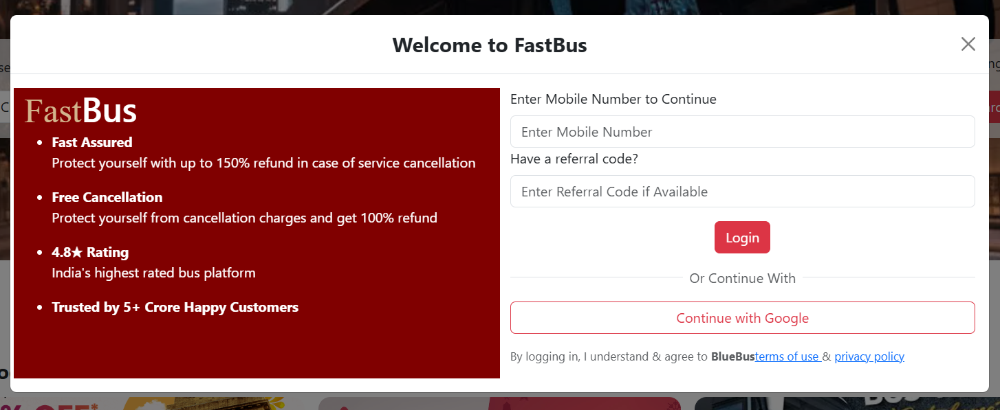

# 🚌 Bus Ticket Booking System

## 🚀 Tech Stack
- Frontend: React.js, HTML, CSS, JavaScript  
- Backend: Java  
- Database: MySQL  

## ✨ Features
- User authentication (Login/Register)  
- Seat booking system  
- CRUD operations  
- Responsive UI  

## 📸 Screenshots
![Home] (Screenshot 2026-03-29 134838.png)

![SRTC] (Screenshot 2026-03-29 134948.png)
![About] (Screenshot 2026-03-29 135017.png)

## 📌 Description
This is a full stack web application for booking bus tickets.  
It allows users to register, login, and book seats with real-time data handling using Java and MySQL.

## ⚙️ Setup Instructions
1. Clone the repo  
2. Install dependencies  
3. Run frontend and backend servers  

## 👩‍💻 Author
Lakshya A
